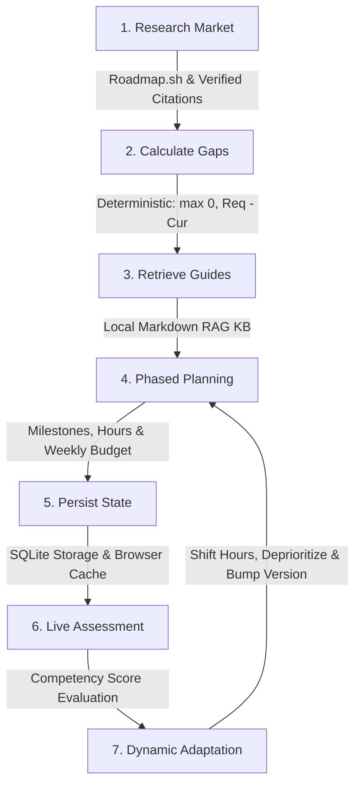

<div align="center">

# 🚀 CareerForge AI

### **Precision Career & Placement Intelligence Engine**
*Deterministic Skill Gap Analysis · Adaptive Phased Roadmaps · Closed-Loop Recalibration Studio*

[](https://www.python.org/)
[](https://fastapi.tiangolo.com/)
[](https://react.dev/)
[](https://www.typescriptlang.org/)
[](https://vitejs.dev/)
[](https://www.sqlite.org/)
[](https://www.docker.com/)
[](https://azure.microsoft.com/)
[](https://docs.pytest.org/)

<p align="center">
  <a href="#-overview">Overview</a> •
  <a href="#-key-architectural-pillars">Architecture</a> •
  <a href="#-7-step-preparation-loop">7-Step Loop</a> •
  <a href="#-features--workstations">Features</a> •
  <a href="#-tech-stack">Tech Stack</a> •
  <a href="#-getting-started">Quickstart</a> •
  <a href="#-environment-configuration">Configuration</a> •
  <a href="#-testing--validation">Tests</a>
</p>

</div>

---

## 📌 Overview

**CareerForge AI** is an enterprise-grade placement preparation and career roadmap synthesis engine. Unlike generic AI chatbots that hallucinate arbitrary study schedules, CareerForge AI pairs **100% deterministic mathematical scoring** with an **autonomous closed-loop agent**. 

Students can search any dream career, benchmark their current competencies against real industry expectations, synthesize a customized phased roadmap, and verify their growth through an adaptive assessment recalibration engine.

```
                  ┌────────────────────────────────────────────────────────┐
                  │                 CAREERFORGE AI ENGINE                  │
                  └────────────────────────────────────────────────────────┘
                                              │
           ┌──────────────────────────────────┴──────────────────────────────────┐
           ▼                                                                     ▼
┌──────────────────────┐                                              ┌──────────────────────┐
│  DETERMINISTIC MATH  │                                              │   LLM ENRICHMENT     │
│ ──────────────────── │                                              │ ──────────────────── │
│ • Gap = max(0, R - C)│                                              │ • Pedagogy & Tips    │
│ • Hours = Σ(Gap × 15)│                                              │ • Explainable Coach  │
│ • Zero Hallucination │                                              │ • Custom Roles (Opt) │
└──────────────────────┘                                              └──────────────────────┘
           │                                                                     │
           └──────────────────────────────────┬──────────────────────────────────┘
                                              ▼
                               ┌─────────────────────────────┐
                               │   ADAPTIVE PHASED ROADMAP   │
                               │  Versioned Revision Engine  │
                               └─────────────────────────────┘
```

---

## 🏛️ Key Architectural Pillars

### 1. Pure Deterministic Precision (Zero Math Drift)
* All core metrics—including **Skill Gaps**, **Preparation Hours**, **Bandwidth Allocation**, and **Readiness Percentages**—are calculated strictly with deterministic mathematical formulas:
  $$\text{Skill Gap} = \max(0,\, \text{Required Level} - \text{Current Level})$$
  $$\text{Readiness Index} = \left( \frac{\sum \min(1.0,\, \text{Current} / \text{Required})}{N} \right) \times 100$$
* The LLM is **never** permitted to calculate gaps, hours, or percentages, eliminating mathematical hallucinations.

### 2. Closed-Loop Recalibration Studio
* As students complete assessments or log quiz scores, the **Recalibration Engine** recalculates remaining gaps in real time.
* If a competency is mastered ($Gap = 0$), the agent automatically deprioritizes or completes that roadmap phase, reclaims allocated bandwidth, and shifts hours to remaining high-priority bottlenecks.
* Every adaptation increments the roadmap version ($v1.0 \to v2.0$) and displays an explainable **Diff Strip** detailing hours saved and timeline revisions.

### 3. Dual-Mode Execution (Offline Resilient + Azure AI)
* **Local / Mock Mode (Default)**: Fully functional out of the box with zero external API keys. Runs against **27+ curated industry role standards**, offline deterministic algorithms, and verified citations.
* **Azure OpenAI Mode**: Seamlessly switches to Azure AI Foundry (`gpt-4o-mini`) when credentials are provided, enabling dynamic synthesis for unusual career tracks and tailored pedagogical milestone guidance.

### 4. Resilient Community Disk Cache & Auto-Fallback
* Researched market standards and dynamic role syntheses are persisted to a disk cache (`cache/market_research.json` and `cache/ai_synthesized_roles.json`).
* If an API key expires, encounters rate limits, or goes offline, CareerForge automatically serves previously synthesized community benchmarks and falls back to its offline multi-domain taxonomy.

---

## 🔄 7-Step Preparation Loop

CareerForge AI executes an autonomous 7-step career readiness pipeline:



| Step | Action | Description |
| :--- | :--- | :--- |
| **1. Research** | `web_search_market` | Queries role requirements, demand levels, and authentic documentation citations. |
| **2. Analyze** | `calculate_skill_gaps` | Computes deficiency values ($0.0 - 5.0$) and assigns priority levels (*Critical, High, Moderate, Mastered*). |
| **3. Retrieve** | `retrieve_knowledge_base` | Local RAG engine matches high-yield curated preparation guides and section anchors. |
| **4. Plan** | `_build_roadmap_phases` | Partitions competencies into sequential stages, budgets weekly hours, and sets milestones. |
| **5. Persist** | `DatabaseManager` | Stores profiles, active roadmaps, milestones, and assessment history into persistent SQLite. |
| **6. Assess** | `evaluate_assessment` | Scores competency tests ($0\% - 100\%$) and calculates updated proficiency: $\Delta = (Score - 50) \times 0.02$. |
| **7. Adapt** | `adapt_roadmap_on_assessment`| Dynamically rebalances phases, completes mastered stages, updates roadmap revision ($v2.0$), and produces coaching summaries. |

---

## 🖥️ Features & Workstations

### 🔍 Dream Job Search & Curriculum Explorer
* **Hero Search Bar**: Natural language query expansion with automatic tech abbreviation handling (`SDE`, `SWE`, `ML`, `DevOps`, `QA`, etc.).
* **Explore Career Curriculums**: Pre-calibrated tracks across 13 industry domains:
  * *Backend & Cloud, Web & Mobile, AI & Data Science, Security & Networks, Games & Graphics*
  * *Medicine & Healthcare, Finance & Banking, Core Engineering, Law & Legal Services, Aviation, UI/UX Design, Product Management*
* **Real-time Autocomplete**: Instant suggestion dropdown with token similarity scoring and AI track detection.

### 🎛️ Tune Plan Page (Skill Calibration)
* **Custom Baselines**: Calibrate skill proficiencies on a 0.0 to 4.5 rating scale with instant bulk shortcuts (*All Beginner*, *All Never*, *Clear Form*).
* **Target Company Tiers**: Select target enterprise tier (*FAANG Tier-1, Scaleup, Quantitative FinTech, Enterprise SaaS, Startup*).
* **Fast Resume Skill Extraction**: Paste plain-text resume content to automatically match and calibrate skills.

### 📊 Dashboard & Readiness Analytics
* **Animated Readiness Ring**: Real-time circular meter showing placement readiness percentage with status badges (*Placement Ready, Accelerating, Building Core*).
* **Bandwidth Budget Allocation Strip**: Interactive stacked progress strip visualising exact preparation hours budgeted per skill.
* **Velocity Runway**: Estimated weeks to completion dynamically computed from available weekly study hours.

### 🧩 Skill Gap Matrix (Multi-View)
* **Table Dimension**: Priority badges, required levels, current proficiency, and raw deficit metrics.
* **Heatmap Dimension**: Visual density grid illustrating skill distribution across levels.
* **Radar Dimension**: Interactive competency spider chart comparing baseline capability against market benchmarks.

### 🗺️ Phased Roadmap Timeline
* **Interactive Phases**: Sequential execution timeline with status tags (*In Progress, Not Started, Completed*).
* **Interactive Milestone Checklist**: Check off practical objectives backed by real-time backend persistence.
* **Curated Study Guide Links**: Direct deep-links to comprehensive markdown preparation guides.

### ⚡ Recalibration Studio & Diff Engine
* **Closed-Loop Simulator**: Test competencies or simulate quiz scores to trigger instant plan adaptation.
* **Pinned Diff Strip**: Shows version progression ($v1.0 \to v2.0$), hours saved, and qualitative AI coaching summary.

---

## 🛠️ Tech Stack

### Frontend
* **Core**: [React 19](https://react.dev/), [TypeScript 5.5](https://www.typescriptlang.org/), [Vite 6.0](https://vitejs.dev/)
* **Styling**: Vanilla CSS Variables, [Tailwind CSS](https://tailwindcss.com/)
* **Animations**: [Motion](https://motion.dev/) (Framer Motion)
* **Icons**: [Lucide React](https://lucide.dev/)
* **Notifications**: [Sonner](https://sonner.emilkowal.ski/)
* **Avatars**: [DiceBear API](https://www.dicebear.com/) (Bottts & Avataaars)

### Backend
* **Runtime**: [Python 3.12](https://www.python.org/)
* **Framework**: [FastAPI](https://fastapi.tiangolo.com/), [Uvicorn](https://www.uvicorn.org/)
* **Data Validation**: [Pydantic v2](https://docs.pydantic.dev/)
* **Database**: [SQLite3](https://www.sqlite.org/) with WAL journaling mode
* **HTTP Client**: [HTTPX](https://www.python-httpx.org/)
* **Testing**: [Pytest](https://docs.pytest.org/), [pytest-cov](https://pytest-cov.readthedocs.io/)

### AI & Cloud
* **LLM Engine**: Azure AI Foundry / Azure OpenAI Service (`gpt-4o-mini`)
* **Containerization**: Multi-stage lightweight [Docker](https://www.docker.com/) container

---

## 🚀 Getting Started

### Prerequisites
* **Python**: 3.12 or higher
* **Node.js**: 18.0 or higher
* **npm**: 9.0 or higher

### Quickstart (Concurrent Run)

1. **Clone the repository**:
   ```bash
   git clone https://github.com/Khush155/CareerForge-AI.git
   cd CareerForge-AI
   ```

2. **Install all dependencies**:
   ```bash
   # Install root dependencies
   npm install

   # Install frontend dependencies
   cd frontend && npm install && cd ..

   # Install backend Python dependencies
   pip install -r backend/requirements.txt
   ```

3. **Start both Frontend & Backend with 1 command**:
   ```bash
   npm run dev
   ```
   * Frontend will launch at: **`http://localhost:5173`**
   * Backend API will launch at: **`http://127.0.0.1:8000`**
   * Interactive API Swagger Docs: **`http://127.0.0.1:8000/docs`**

---

### Manual Setup (Separate Terminals)

#### Terminal 1: Backend
```bash
# Set Python path and run FastAPI
python -m uvicorn app.main:app --app-dir backend --reload --port 8000
```

#### Terminal 2: Frontend
```bash
cd frontend
npm run dev -- --port 5173
```

---

### Running via Docker

You can build and deploy CareerForge AI with Docker and Docker Compose:

```bash
# Build and run containerized stack
docker compose up --build

# Or build manually
docker build -t careerforge-ai .
docker run -p 8000:8000 -e PORT=8000 careerforge-ai
```

---

## ⚙️ Environment Configuration

Create a `.env` file in the root directory (or copy from [`.env.example`](file:///d:/Web%20Projects/CareerForge-AI/.env.example)):

```env
# Execution Mode: 'mock' (offline deterministic) or 'azure' (live Azure OpenAI)
MODE=mock

# Database Configuration
DATABASE_PATH=data/careerforge.db
MARKET_CACHE_FILE=cache/market_research.json

# Optional: Azure OpenAI / AI Foundry (required only when MODE=azure)
AZURE_OPENAI_ENDPOINT=https://your-resource-name.openai.azure.com/
AZURE_OPENAI_API_KEY=your-azure-api-key-here
AZURE_OPENAI_DEPLOYMENT_NAME=gpt-4o-mini
AZURE_OPENAI_API_VERSION=2024-02-15-preview
```

---

## 🧪 Testing & Validation

CareerForge AI includes an automated test suite covering deterministic formulas, API endpoints, agent workflows, and caching resilience:

```bash
# Run the complete test suite
python -m pytest backend/tests -v

# Run with coverage report
python -m pytest backend/tests --cov=backend/app --cov-report=term-missing

# Validate frontend TypeScript compilation and build
cd frontend && npm run build
```

```
======================= 67 passed, 1 warning in 10.48s =======================
backend/tests/test_agent.py ...........                                  [ 16%]
backend/tests/test_api.py ..........                                     [ 31%]
backend/tests/test_gap_calculator.py .......                             [ 41%]
backend/tests/test_progress_engine.py ....                               [ 47%]
backend/tests/test_role_resolver.py ....................                 [ 77%]
backend/tests/test_storage.py ......                                     [ 86%]
backend/tests/test_tools.py ..........                                   [100%]
```

---

## 📂 Project Structure

```
CareerForge-AI/
├── backend/
│   ├── app/
│   │   ├── agent/               # Orchestrator & Azure OpenAI integration
│   │   │   ├── azure_client.py  # Dual-mode LLM client with mock fallback
│   │   │   └── orchestrator.py  # 7-step loop coordinator & adaptation engine
│   │   ├── api/
│   │   │   └── routes.py        # REST endpoints (/profile, /assessment, /roles)
│   │   ├── core/
│   │   │   ├── gap_calculator.py# Deterministic gap formula engine
│   │   │   └── progress_engine.py# Competency scoring & delta formulas
│   │   ├── db/
│   │   │   └── storage.py       # SQLite database persistence layer
│   │   ├── models/              # Pydantic v2 schemas (Profile, Roadmap, Gap, Role)
│   │   └── tools/
│   │       ├── knowledge_rag.py # Local markdown RAG study guide retrieval
│   │       ├── market_search.py # Cached industry benchmark search engine
│   │       └── role_resolver.py # Fast fuzzy query matcher & multi-domain taxonomy
│   ├── requirements.txt         # Backend Python dependencies
│   └── tests/                   # 67 comprehensive Pytest test cases
├── cache/                       # Persistent disk caches (market research & AI roles)
├── data/
│   ├── curated_kb/              # High-yield markdown preparation study guides
│   └── roles/                   # 27+ industry-curated role JSON standards
├── frontend/
│   ├── src/
│   │   ├── app/App.tsx          # Main application router and state wireup
│   │   ├── components/          # Domain components (DiffStrip, GapMatrix, RoadmapTimeline)
│   │   ├── features/            # Feature modules (home, plan, dashboard, progress)
│   │   └── lib/                 # Zustand store, API client, schemas, avatar utils
│   ├── package.json
│   └── vite.config.ts
├── Dockerfile                   # Multi-stage production container definition
├── docker-compose.yml           # Single-command Docker Compose orchestration
├── package.json                 # Root script runner (npm run dev)
└── README.md                    # Project documentation
```

---

## 📄 License

This project is open source and available under the **MIT License**.

<div align="center">
  <sub>Built with precision by the CareerForge AI Engineering Team.</sub>
</div>
